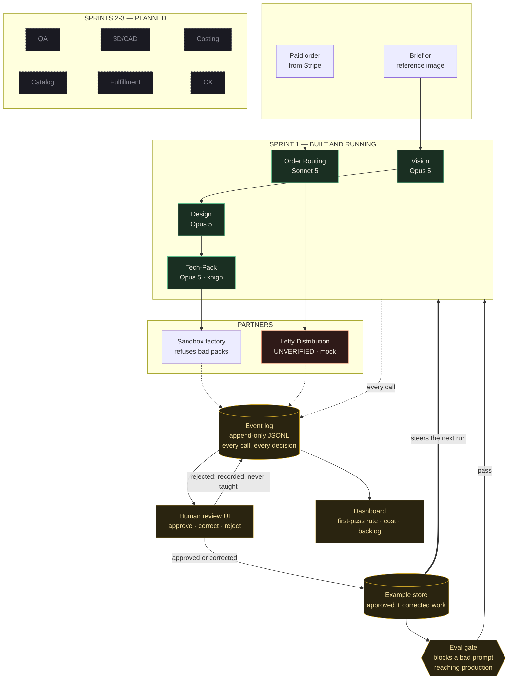

# SML Continuous Learning Agent Ecosystem — implementation plan

**Prepared 27 August 2026 for Self-Made Legends LLC.**
Sprint 1 is built and running. Everything after it is a plan.

---

## Two corrections to the brief, before anything else

### 1. You cannot fine-tune Claude

The brief asks for a "model registry" and "CI/CD for model fine-tuning". That
surface does not exist. There are no weights to version, no training job to
schedule, no checkpoint to roll back.

This is not a limitation to work around. Fine-tuning is the *slow* way to do
what you want:

| | Fine-tuning | What we built |
|---|---|---|
| Time to fix a bad behaviour | Days to weeks | Minutes |
| Cost per improvement | Thousands | Zero |
| Data needed before it works at all | Thousands of examples | One good correction |
| Can you see why it changed? | No | It is a git diff |
| Roll back a regression | Redeploy a checkpoint | `git revert` |

An agent here is **a versioned prompt + a set of approved examples + a model and
its settings**. Change any of the three and you have changed the agent, so all
three are hashed together into one fingerprint stamped on every event. That
fingerprint is what lets you say "quality dropped on Tuesday" and know exactly
what changed on Tuesday.

**The registry is `git`.** Prompts are files. Examples are files. They review in
a pull request and revert with one command.

### 2. Learning requires orders, and you have none

The brief says "learning from real orders". There are no real orders. No product
photos, no Stripe links live, no manufacturer, no sold garment.

That does **not** mean waiting. It means Sprint 1 builds the thing that makes
learning possible later and is useful now — the event log, the review loop, the
eval gate. Every one works at zero orders and gets better as orders arrive.

**You cannot go back and collect the history of a month you did not record.**
That is the whole argument for building this now rather than after the first
sale.

### And one thing I could not verify

**Lefty Distribution.** No public API documentation, and no company web presence
I could find on 27 August 2026 (there is a "Lefty Production Co.", a different
business). The adapter is written against the shape these integrations normally
take and is clearly marked unverified. It runs in mock mode by default so an
unconfigured deploy cannot send garbage to a live partner. When you have their
real docs, one file changes.

---

## Architecture



**The heavy arrow is the loop.** Everything else moves data around. Only that
one adds information the model did not have: a person looking at an output and
saying yes, no, or *nearly — here is the fix*.

---

## The data pipeline

The brief asks for an event stream, a data lake and a vector DB. Here is what
each is actually for, and when you need it.

### Event stream — **built**

`agents/data/events/events-YYYY-MM-DD.jsonl`, append-only.

Every agent call, every human decision, every partner response, every order.
JSONL because it costs nothing, survives a crash mid-write, reads in a text
editor, and every warehouse on earth ingests it.

The schema is versioned. Adding a field is always safe; renaming one is not,
because old files keep the old shape forever.

### Data lake — **not yet, and say when**

Right now the "lake" is a directory. That is correct at this volume.

Move to **S3 + DuckDB** — not Snowflake, not BigQuery — when you cross roughly
**100k events**, or when a query takes longer than you are willing to wait. That
is a loader script reading these same files. The schema does not change.

At your current rate, that is somewhere past year two. Anyone selling you a
warehouse before then is selling you a warehouse.

### Vector DB — **not yet, and here is the honest test**

Retrieval earns its place when you have **more approved examples than fit in a
prompt**. Below roughly 50 per agent, sending the best 8 outright beats
retrieving 8 — it is simpler, cheaper, and there is nothing to debug.

When you cross it: **pgvector** on the Postgres you will already have. Not
Pinecone, not Weaviate, not a separate service with its own bill and its own
outage.

**Trigger:** more than 50 approved examples for any one agent.

---

## The model registry that holds no models

| Component | Where | Versioned by |
|---|---|---|
| Prompt | `agents/prompts/<agent>.v<N>.md` | Filename + git |
| Examples | `agents/data/examples/<agent>/*.json` | Written by review, hashed into the fingerprint |
| Model + settings | `agents/definitions/index.js` | git |
| **Fingerprint** | stamped on every event | all three, hashed together |

A fingerprint looks like `techpack.v1+784c07288e4f`. When quality moves, you
group the event log by that string and the cause is immediately visible.

**Rolling back is `git revert`.** There is no deployment step.

---

## Human review — the only part that actually learns

`node agents/review/server.js` → localhost:4100

Three verdicts, and the difference between them matters:

| Verdict | What happens | Why |
|---|---|---|
| **Approve** | Becomes an example | Confirms good work |
| **Correct** | Becomes a *better* example, marked as a human fix, with your note | The correction encodes exactly what was wrong |
| **Reject** | Recorded, never used as an example | You do not teach by showing bad work |

Corrections are labelled in the prompt as *"a human corrected the agent here —
study the correction"*, and your one-line reason is carried through verbatim.

Blockers sort to the top of the queue. Eval traffic never enters it. Invalid
JSON is refused rather than saved, because that value goes straight into the
store and steers every future run.

**If nobody reviews, nothing improves.** The review backlog is therefore the most
important number on the dashboard.

---

## CI/CD — what actually gets gated

There is no model to deploy. What CI gates is a **prompt change**, which can
break production just as thoroughly as a code change and does it silently and
plausibly.

`npm run agents:eval` — 4 golden cases, 10 assertions, free, no API key needed.

Each assertion exists because getting it wrong costs real money:

| Check | The bill if it fails |
|---|---|
| `hyphenated_name` | Your trademark, written wrong, in a document that goes to a factory |
| `gold_is_embroidered` | A print run in flat mustard where thread was specified |
| `no_invented_precision` | A fabric weight nobody measured, sourced and cut against |
| `stitch_counts_present` | Costing has no basis |
| `no_hex_as_pantone` | A dye house matching to a screen colour |
| `tolerances_present` | The factory decides for itself whether it passed |
| `open_questions_not_empty` | A pack that guessed at something and looks finished |
| `confidence_is_honest` | An agent that cannot express doubt expresses certainty |
| `unroutable_explains` | A five-minute fix becomes a fortnight |
| `split_is_explained` | A customer wondering where half their order is |

**Verified against deliberate regressions.** Four faults were introduced into a
working system — gold as print, a single-number weight, a hex as a Pantone, an
unhyphenated name — and the harness caught all four and exited non-zero. An eval
suite that has never been proven to fail is decoration.

Assertions test the **shape** of a good answer, never exact wording. An eval that
fails on harmless rephrasing gets muted within a fortnight, and then protects
nothing.

---

## Monitoring

`npm run agents:stats`, and the same numbers in the review UI header.

| Metric | Why it is the one to watch |
|---|---|
| **First-pass rate** | Approved with no edits, of everything reviewed. **The health of the whole system.** If it is not climbing week over week, nothing is learning. |
| Review backlog | Nobody reviewing means nobody learning |
| Cache hit rate | Should be 70–90%. Below that, something is invalidating the prefix and the bill is roughly 10x |
| Cost per run | Cheap now; watch the trend, not the number |
| Blocker rate | Rising means an upstream agent regressed |
| Error rate | Parse failures, refusals, timeouts |

Every number is computed **from the event log**, never from counters kept
alongside it. A counter can drift away from the events it claims to summarise. A
reduction over the events cannot.

---

## What things actually cost

### The model calls — much less than you would think

Per full concept run (vision → design → tech pack), on Opus 5, with the brand
context cached:

| | Tokens | Cost |
|---|---|---|
| Fresh input | ~7,000 | $0.035 |
| Cached input | ~15,000 | $0.008 |
| Output | ~13,000 | $0.325 |
| **Per concept** | | **~$0.37** |
| Same, via the Batch API (50%) | | **~$0.19** |

| Volume | Monthly |
|---|---|
| 20 concepts | **$7** |
| 100 concepts | **$37** |
| 500 concepts | **$185** |
| 1,000 orders routed (Sonnet 5) | **~$12** |

Prices: Opus 5 $5/$25 per MTok, Sonnet 5 $2/$10, cache reads 0.1×, cache writes
1.25×, batch 50%. Verified 27 August 2026.

**Caching is not optional.** The brand rules plus the agent prompt plus the
examples are ~15k tokens of identical prefix on every call. Cached they cost
$0.008; uncached, $0.075 — ten times more, on every single call, with nothing
visibly broken. This is why the system-block order in `runtime/client.js` is
documented rather than left to be rediscovered.

### Hosting — staged, and stage 0 is where you are

| Stage | When | What | Monthly |
|---|---|---|---|
| **0 — now** | 0–50 concepts/mo | Runs on your laptop. JSONL files. Review UI on localhost. | **$0** |
| **1** | First real orders | Railway worker + Postgres. Review UI behind auth. | **$25–40** |
| **2** | ~100 orders/mo | + S3 for the lake, pgvector on the same Postgres | **$60–90** |
| **3** | Real volume | + queue, + read replica, + Grafana | **$200–350** |

**Do not build stage 2 while you are at stage 0.** The spec as written — data
lake, vector DB, model registry, monitoring dashboards, on managed services —
prices out at **$400–900/month** to learn from **zero orders**. That is the most
expensive way to find out nothing.

### Total, realistically

| | Monthly |
|---|---|
| Today, stage 0, 20 concepts | **~$7** |
| First orders, stage 1, 100 concepts | **~$65** |
| Real volume, stage 3, 500 concepts + 1k orders | **~$500** |

---

## Sprint 1 — done

Everything below is written, running, and tested end to end in stub mode with no
API key.

| | Status |
|---|---|
| Event log with a versioned envelope | ✅ |
| Prompt + example registry with fingerprinting | ✅ |
| Agent runtime — caching, cost accounting, structured outputs, stub mode | ✅ |
| Brand rules as a shared cached prefix | ✅ |
| Vision, Design, Tech-Pack, Order Routing — real prompts and schemas | ✅ |
| Pipeline: brief → design → tech pack → factory | ✅ |
| Pipeline: order → route → partner | ✅ |
| Sandbox manufacturer that **refuses** incomplete packs | ✅ |
| Lefty adapter (unverified, mock by default) | ✅ |
| Human review UI, three verdicts, feeding the example store | ✅ |
| Eval harness, 10 assertions, **proven against deliberate regressions** | ✅ |
| Tech-pack template + QA checklist | ✅ |
| Monitoring — first-pass rate, cache hit, cost, backlog | ✅ |
| CLI | ✅ |

**Proven, not asserted:** a human correction was entered through the review UI
and then confirmed to reach the next run's prompt — labelled as a human fix,
with the reviewer's reasoning carried through, and the version fingerprint
moved. That is the loop closed.

### What Sprint 1 deliberately does not do

- **No real API calls yet.** Everything runs on stubs. Set `ANTHROPIC_API_KEY`
  and pass `--live` when you want to spend money.
- **No real manufacturer.** The sandbox is a fake factory that behaves like a
  real one — it refuses work it cannot do and holds packs with open questions,
  because a sandbox that always says yes hides every bug in your error handling.
- **Six agents are declared but not built.** They appear in the system as
  "planned" rather than being absent, so the gap is visible instead of forgotten.

---

## The 90 days

Milestones are gated on **evidence**, not dates. A sprint that "finished" without
its exit criterion did not finish.

### Days 1–14 · Sprint 1 — foundation ✅ *complete*
**Exit:** pipeline runs end to end, evals catch a planted regression, a
correction demonstrably reaches the next run. **All three met.**

### Days 15–30 · Sprint 2 — first live output
1. Set `ANTHROPIC_API_KEY`, run 10 concepts live, review every one
2. Read the first outputs against the QA checklist by hand — you will find
   things the evals do not check. Add them as checks.
3. Promote the best outputs to examples
4. Rewrite any prompt that produced a bad output, and re-run the evals

**Exit criterion:** **first-pass rate above 40%** on 20 reviewed outputs.
Below that, the prompts are not ready and no amount of extra agents will help.

### Days 31–45 · Sprint 3 — a real factory
1. Approach 2–3 manufacturers with a real tech pack from this system
2. Get one to accept a pack and quote it
3. Replace the sandbox with a real adapter
4. **Sample arrives → put the QA result back into the review UI**

**Exit criterion:** one physical sample, in your hands, made from an
agent-produced tech pack. That single object tells you more than the previous 45
days of output combined.

### Days 46–60 · Sprint 4 — QA and Costing agents
QA reads a sample photo against the pack. Costing turns a tech pack into a
landed cost from stitch counts, fabric consumption and partner rates.

**Exit criterion:** costing within 15% of a real factory quote on three styles.

### Days 61–75 · Sprint 5 — orders, for real
1. Stripe Payment Links live *(this is blocked on product photos, not on code)*
2. Order events flow into the same log
3. Routing runs against a real partner
4. Fulfillment agent + CX agent

**Exit criterion:** one real order routed, made and shipped end to end.

### Days 76–90 · Sprint 6 — scale what works
Catalog agent (product copy from tech packs, straight into `shop.js`). 3D/CAD
only if a factory has asked for it — otherwise skip it, it is the least useful
of the ten for a wholesale house.

Move to stage 1 hosting. Review the first-pass trend across 90 days.

**Exit criterion:** first-pass rate above 70% and still climbing.

---

## The dependency nobody wants to hear

**Sprints 3 and 5 are blocked on things no code can produce.**

You need a manufacturer who will take a pack. You need product photographs. You
need the trademark filed and the IP assignment signed. Those are phone calls and
a camera, and this system cannot make any of them for you.

What it can do — starting today, at zero orders — is make sure that when the
first real design goes to a real factory, every judgement anyone makes about it
is captured and compounds.

---

## Where the risk actually is

| Risk | Likelihood | What it costs | What we did |
|---|---|---|---|
| **Nobody reviews** | **High** | The entire system becomes an expensive text generator | Backlog is the headline metric; review takes ~90 seconds an item |
| An invented number reaches a factory | Medium | A re-cut, six weeks, real money | `UNKNOWN` is mandatory, evals enforce it, the sandbox refuses packs with open blockers |
| A prompt edit silently regresses quality | Medium | Weeks of bad output before anyone notices | Eval gate in CI, proven to fail on planted faults |
| Cache prefix broken by a refactor | Medium | ~10× the bill, nothing visibly wrong | Block order documented in code; cache hit rate on the dashboard |
| Lefty's real API differs from the guess | **Certain** | Rework | Isolated behind an adapter; one file |
| Building stage 2 infrastructure at stage 0 | Medium | $400–900/mo for nothing | Staged hosting with explicit triggers |

---

## Running it

```bash
npm run agents:partners                      # who is reachable, what they can do
npm run agents:concept -- "your brief here"  # brief → design → tech pack → factory
npm run agents:order -- order.json           # route an order
npm run agents:review                        # the review UI — localhost:4100
npm run agents:eval                          # the gate
npm run agents:stats                         # what the agents have been doing
```

Everything defaults to stub mode: free, no API key, nothing reaches a real
partner. Add `--live` to spend money. That default is deliberate — the expensive
mistakes in a system like this are all made by something running when the
operator thought it was not.

---

*Sprint 1 code is in `agents/`. Every claim of "built" above was run and its
output read before it was written down here.*
